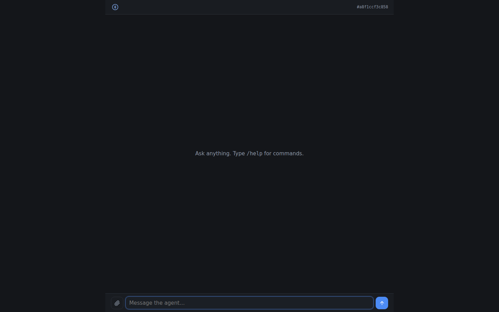
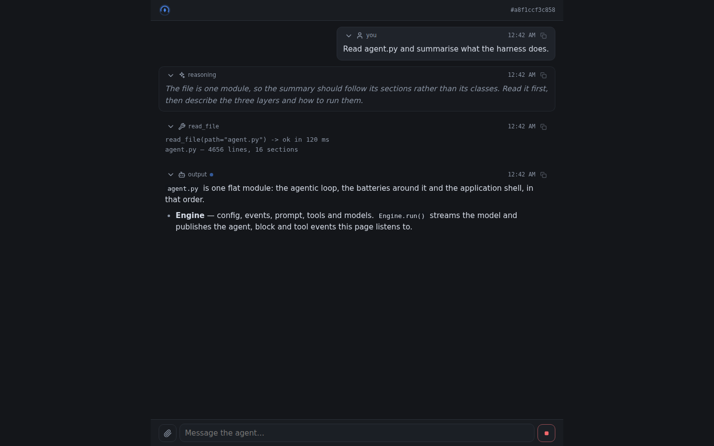
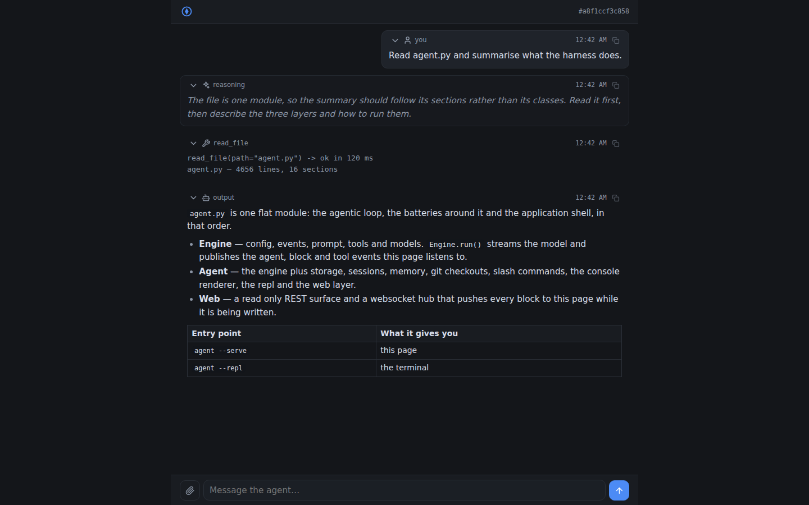
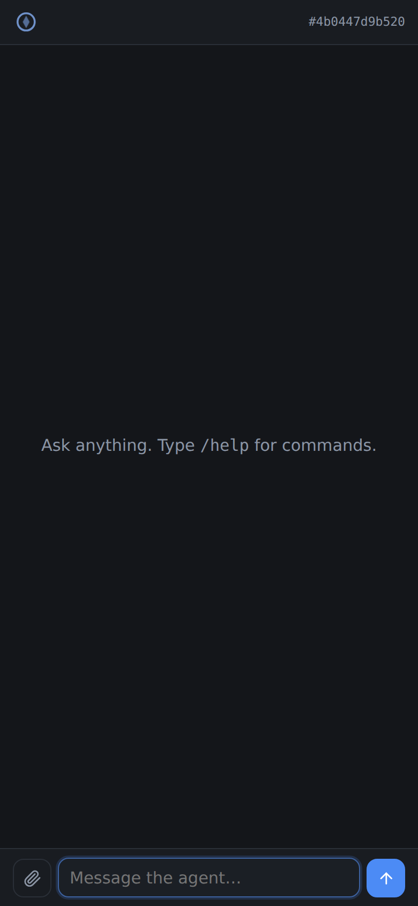
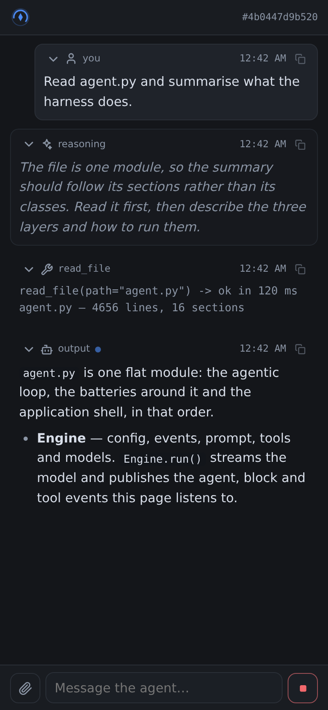
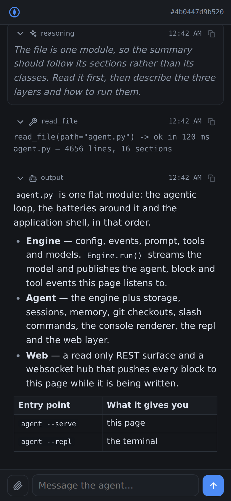
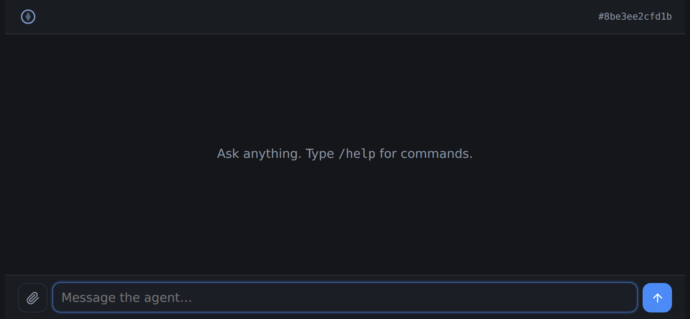
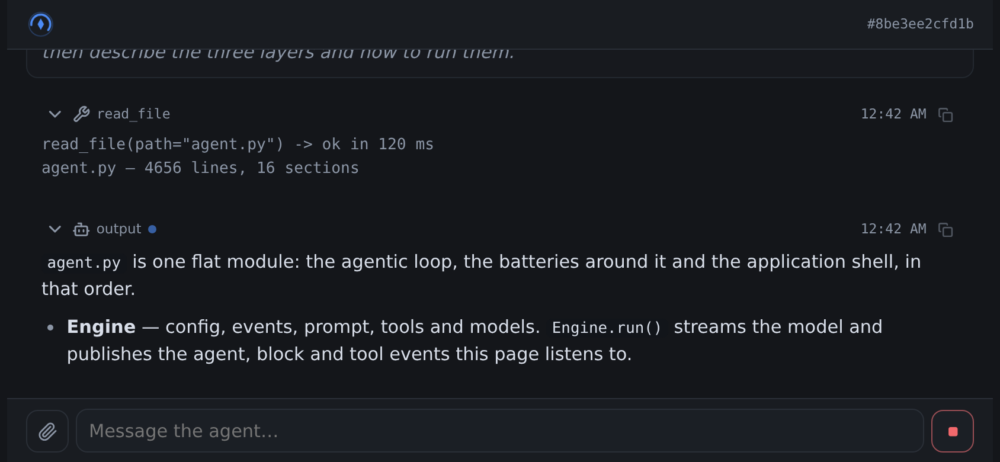
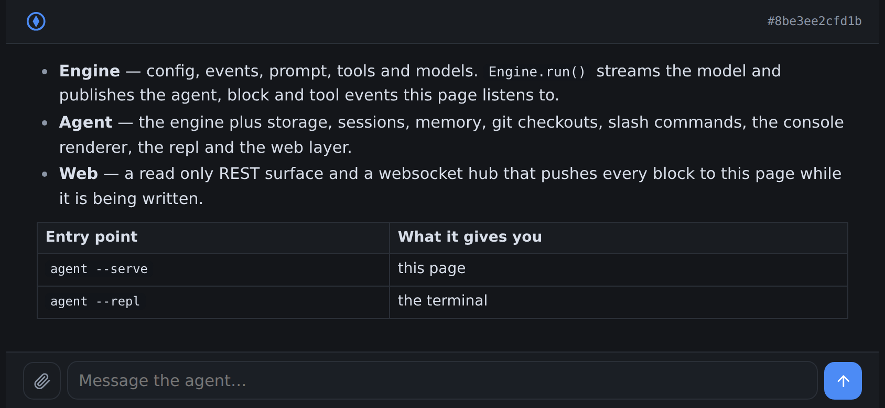

# agent — Guide

A walkthrough of the implementation. It follows the module from the outside in:
the shape of a run first, then each subsystem in the order `agent.py` declares
them, then the reference tables (configuration, tools, protocol) and the
extension points.

[`README.md`](README.md) is the summary and the quickstart, [`CHANGES.md`](CHANGES.md)
is what has been built and why, and [`TODO.md`](TODO.md) is what is left.

---

## 1. Layout

| File              | Contents                                        |
| ----------------- | ----------------------------------------------- |
| `agent.py`        | The library: every subsystem and the CLI        |
| `agent_test.py`   | Unit tests                                      |
| `agent_e2e.py`    | Browser capture of the page, scripted end to end |
| `agent_ui.html` | Chat page markup                                |
| `agent_ui.css`  | Mobile first, theme driven styles               |
| `agent_ui.js`   | Client: blocks, markdown, media, commands, hub  |
| `assets/`         | The screenshots this guide shows                |
| `pyproject.toml`  | Package metadata, dependencies, `agent` script  |

`agent.py` is a single flat module divided by commented section banners, in this
order: **config, events, prompt, storage, sessions, memory, repository,
resilience, models, tools, console, commands, core, repl, web, cli**. Each
section is self-contained and depends only on the ones above it, so the file
reads top to bottom.

Dependencies: `openai` and `openai-agents` (the loop), `jinja2` (templates),
`omegaconf` (config files), `websockets` (transport), `cachetools` (LRU).
Python 3.12 or newer.

## 2. Two entry points

The core is split in two classes so the loop can be used without the harness
around it.

`Engine` is the loop: a config, an event bus, a prompt renderer, a tool registry
and a model pool, and nothing else. `Engine.run(model_input, ...)` takes the
model input verbatim — a prompt string or the chat messages the caller assembled
from its own history — builds the tools (the ones passed in, or the built-in set
for a workspace, or none), builds the SDK agent and streams it, publishing the
same `agent.*`, `block.*` and `tool.*` events and returning the same
`RunResult`. It creates no database, no session, no workspace and no console, so
an application that already has that infrastructure embeds it directly and pays
for nothing it does not use. `env=False` keeps the `AGENT_*` environment out of
the resolved config, and `config_file=False` keeps a stray `agent.yaml` in the
working directory of the host process out of it too.

`Agent` subclasses `Engine` and adds the batteries: storage, sessions and their
workspaces, conversation memory, git checkouts, slash commands, the console
renderer, the repl and the web layer. Both share `resolve_config`, `build_model`,
`build_vision`, `build_tools`, `build_sdk_agent`, `turn`, `stream` and the
`running()` lifecycle, so an override or an injected collaborator behaves the
same in either.

## 3. The shape of a run

`Agent.run(template, **overrides)` is the whole story:

1. **Resolve the config.** `resolve_config()` merges overrides onto the instance
   config and turns `input` (a file path or raw text) into `config.input`.
2. **Acquire a session.** Expired sessions are purged, then an existing session
   is reused or a new workspace is created.
3. **Prepare the session.** If a repository is configured it is cloned into the
   workspace on a session branch (idempotent, and never fatal).
4. **Publish `agent.start`.** Subscribers (console, web) react.
5. **Render the prompt.** `build_prompt()` renders the template against the
   config, then `decorate_prompt()` appends the attachment listing.
6. **Build the tools.** A `Workspace` is scoped to the session directory and the
   registry builds the tool list for it, including the git tools when the
   session has a checkout.
7. **Build the SDK agent** with the leader model, the instructions and the tools.
8. **Build the model input.** `build_input()` prepends what the session
   remembers, so the prompt is the newest message of a conversation rather than
   a one shot request.
9. **Stream.** `stream()` consumes the SDK event stream and republishes it as
   `block.*` and `tool.*` events, under a stall guard and, while nothing has
   been produced yet, the retry policy of the run.
10. **Remember.** `remember()` appends the exchange to the transcript of the
    session, trimming (or summarising) it back inside its budget.
11. **Finish.** `agent.end` (or `agent.error`) is published with the tokens and
    the cost of the run, and a `RunResult` is returned; cancellation is
    re-raised after being recorded.

Failures inside the loop are captured on the result rather than raised, so a
caller always gets a `RunResult` and can branch on `result.ok`, on
`result.error_kind` for what went wrong and on `result.transient` for whether
running it again might work.

## 4. Config

`AgentConfig` is a dataclass with five composition methods:

- `merge(**overrides)` — copy with non-`None` overrides applied; unknown keys go
  to `extras`.
- `with_data(mapping)` — copy with a parsed mapping applied, coerced to the
  annotated type (`int`, `float`, `bool`, `Path`, `str`).
- `with_file(path)` — copy with a JSON or YAML file applied; without a path the
  one `find_config_file()` locates.
- `with_env(environ)` — copy with `AGENT_<FIELD>` overrides applied, coerced the
  same way.
- `model_spec(role)` — resolve a role to a `ModelSpec`, or `None`.

`__getattr__` falls back to `extras`, so `config.genre` works in a template when
`genre` was passed as an override. `to_dict(redact=True)` masks anything
`is_secret_key()` recognizes, and `banner_items()` is the console summary.

Resolution order is **defaults → config file → environment → explicit
arguments**, applied in `Engine.__init__` and again per run in
`resolve_config()`.

### Config files

`find_config_file()` looks for `<stem>.json`, `<stem>.yaml` and `<stem>.yml`,
where the stem is the name of the module itself (`agent`), in the current
directory first and in the directory of `agent.py` as a fallback — so an
application overrides whatever ships beside the harness. The first file that
exists wins; there is no merging between them.

- `config_directories()` is the search path, `config_candidates()` every path
  that is looked at, in order, and `read_config_file(path)` the reader.
- Files are parsed with `omegaconf`, so `${oc.env:VAR}` and `${other.key}`
  interpolations resolve at read time. Without it JSON still works and YAML
  falls back to `pyyaml`.
- `flatten_config()` flattens a nested group onto field names — `vision: {model:
  v}` becomes `vision_model` — but only when every key of the group names a real
  field. Anything else stays as it is and becomes an extra, and a nested
  `extras:` mapping is folded in as is.
- A `null` value leaves the default in place, an empty file is harmless and a
  file that is not a mapping is an error.

`Engine(config_file=...)` decides what the layer reads: `True` (the default)
searches, `False` or `None` skips the layer, and a path is taken as given — a
path that does not exist raises, because the caller named that file. The
resolved path stays on the instance as `engine.config_file`, which is what the
repl banner reports. `--config path` is the same switch from the command line.

```yaml
# agent.yaml
name: scribe
model: some/leader-model
api_key: ${oc.env:AGENT_API_KEY}   # omit it entirely for keyless endpoints
vision:
  model: some/vision-model
  max_tokens: 2048
memory:
  summary: true
template: ./prompt.md
genre: noir
```

### Configuration reference

| Variable / field                                            | Meaning                                     |
| ----------------------------------------------------------- | ------------------------------------------- |
| `AGENT_NAME`, `AGENT_INSTRUCTIONS`                          | Agent name and system instructions          |
| `AGENT_MODEL`, `AGENT_API_URL`, `AGENT_API_KEY`             | Leader model, endpoint and credential       |
| `AGENT_MAX_TURNS`                                           | Maximum agentic turns per run               |
| `AGENT_REQUEST_TIMEOUT`                                     | Timeout per model call; leader stall guard  |
| `AGENT_RETRY_ATTEMPTS`                                      | Attempts per model call (`1` never retries) |
| `AGENT_RETRY_BACKOFF`, `AGENT_RETRY_MAX_BACKOFF`            | First wait between attempts, and its cap    |
| `AGENT_RETRY_JITTER`                                        | Fraction of a wait that is randomized       |
| `AGENT_COST_INPUT`, `AGENT_COST_OUTPUT`                     | Price of a million input / output tokens    |
| `AGENT_VISION_MODEL`                                        | Vision specialist (unset: the leader sees)  |
| `AGENT_VISION_API_URL`, `AGENT_VISION_API_KEY`              | Vision endpoint (defaults to the leader's)  |
| `AGENT_VISION_INSTRUCTIONS`, `AGENT_VISION_MAX_TOKENS`      | Vision system prompt and answer budget      |
| `AGENT_MEMORY_ENABLED`                                      | Remember the conversation of a session      |
| `AGENT_MEMORY_MAX_TURNS`, `AGENT_MEMORY_MAX_CHARS`          | Memory budget (`0` disables a limit)        |
| `AGENT_MEMORY_SUMMARY`                                      | Summarise trimmed turns instead of dropping |
| `AGENT_SUMMARY_MODEL`, `AGENT_SUMMARY_API_URL`, `AGENT_SUMMARY_API_KEY` | Summary role (defaults to the leader) |
| `AGENT_SUMMARY_INSTRUCTIONS`, `AGENT_SUMMARY_MAX_TOKENS`    | Summary system prompt and answer budget     |
| `AGENT_INPUT_SOURCE`                                        | Input path or text (also `--input`)         |
| `AGENT_TEMPLATE`                                            | Template path or raw template for `main()`  |
| `AGENT_WORKSPACE_ROOT`, `AGENT_WORKSPACE_SEED`              | Parent of workspaces; directory copied in   |
| `AGENT_SESSION_TTL`, `AGENT_KEEP_WORKSPACE`                 | Session lifetime; keep the directory        |
| `AGENT_SESSION_DURABLE`, `AGENT_SESSION_SWEEP_INTERVAL`      | Survive a restart; expiry sweep period      |
| `AGENT_REPO_URL`, `AGENT_REPO_BRANCH`, `AGENT_REPO_TOKEN`   | Default repository, base branch, credential |
| `AGENT_REPO_REMOTE`, `AGENT_REPO_BRANCH_PREFIX`, `AGENT_REPO_DIR` | Remote name, branch prefix, clone dir |
| `AGENT_REPO_AUTHOR_NAME`, `AGENT_REPO_AUTHOR_EMAIL`         | Identity the harness commits with           |
| `AGENT_REPO_DEPTH`, `AGENT_REPO_CLONE`, `AGENT_REPO_TIMEOUT`| Clone depth, auto clone, git timeout        |
| `AGENT_DB_PATH`, `AGENT_CACHE_SIZE`                         | SQLite file and LRU capacity                |
| `AGENT_SHELL_TIMEOUT`, `AGENT_SHELL_ENABLED`                | Shell tool limits                           |
| `AGENT_HOST`, `AGENT_PORT`, `AGENT_THEME`                   | Web bind address and UI theme file          |
| `AGENT_QUIET`, `AGENT_COLOR`                                | Console output                              |

Anything not listed is an extra: pass it as a constructor override and read it in
the template as `config.<name>`.

## 5. Events

`EventBus.publish(type, session_id=..., **data)` builds an `Event` and delivers
it to the subscribers of that type plus the subscribers of `EventType.ALL`.
Handlers may be sync or async; exceptions are printed to stderr and swallowed.
`on()` returns an unsubscriber.

| Event                          | Payload                                    |
| ------------------------------ | ------------------------------------------ |
| `agent.start`                  | `config` (never forwarded to the web)      |
| `agent.end`                    | `output`, `error`, `error_kind`, `usage`, `config` |
| `agent.error`                  | `error`, `error_kind`                      |
| `block.start`                  | `id`, `kind`, `role`                       |
| `block.delta`                  | `id`, `kind`, `text` (the delta)           |
| `block.end`                    | `id`, `kind`, `text` (the full block)      |
| `tool.start`                   | `id`, `kind`, `name`, `call_id`, `arguments`, `text` |
| `tool.end`                     | the above plus `ok`, `result`, `duration`  |
| `model.retry`                  | `role`, `error_kind`, `attempt`, `attempts`, `delay`, `error` |
| `session.open`, `session.close`| `kind`, `repo`                             |
| `log`                          | `kind`, `message`                          |

## 6. Prompt

`PromptRenderer` wraps a Jinja `SandboxedEnvironment` with `StrictUndefined` and
`autoescape=False` (the output is a prompt, not HTML). `render(template, config,
**context)` exposes the config as `config` and any context keys by name;
`render_file(path, ...)` reads a template from disk. Output is stripped.

`Agent.decorate_prompt()` appends an `## Attached files` listing when the run
carries attachments, unless the template already contains that heading.

## 7. Storage and cache

`Store` is a namespaced key/value protocol (`get`, `set`, `delete`, `list`,
`close`) with two implementations: `MemoryStore` for tests and `SqliteStore`,
which keeps JSON values in a `store(namespace, key, value, updated_at)` table
and falls back to an in-memory database when no path is given.

`Cache` is `get`/`set`/`delete`/`clear`, implemented by `LruCache` over
`cachetools` with an optional TTL. Sessions are written to both.

## 8. Sessions

`Session` is `id`, `workspace`, `created_at`, `expires_at` and free-form `meta`
(the git checkout lives under `meta["repo"]`). `SessionManager`:

- `create(**meta)` — a 12 hex character id, a `mkdtemp` workspace under
  `workspace_root`, optionally seeded from `workspace_seed`, persisted to the
  store and the cache.
- `get(id)` — returns the session, closing it first if it has expired and
  renewing its lease otherwise, so an active session is never expired under a
  client and an idle one still runs out.
- `ensure(id)` — get or create.
- `update(session)` — re-persist after mutating `meta`.
- `list()`, `close(id)`, `purge_expired()`, `close_all(destroy=None)`.

`_destroy()` removes the directory (unless `keep_workspace`), the store record
and the cache entry. `_persist()` and `_destroy()` are the hooks to override for
a different lifecycle.

### Durability

The store record of a live session is what makes a session outlive its process:

- `restore()` — called on construction, it rehydrates the sessions the store
  still holds. A record that cannot be read, whose lease has run out or whose
  directory is gone is reconciled away (`_destroy()`) instead of adopted, so a
  restart never hands out a session without a workspace.
- `orphans()` / `reap_orphans()` — directories under `workspace_root` named
  `<prefix>-*` that no live session owns. Only a configured root is scanned and
  only directories this manager could have created, so a shared temporary
  directory is never touched; `keep_workspace` reaps nothing.
- `sweep()` — `purge_expired()` plus `reap_orphans()`.
- `start_sweeper()` / `stop_sweeper()` — run `sweep()` every
  `session_sweep_interval` seconds (`0` disables the timer) on the running loop.
  `WebServer.serve()` starts it and stops it with the server, and
  `Agent.aclose()` stops it too. A failing sweep is reported, not fatal.

`session_durable` decides what a shutdown means: by default `close_all()`
destroys every workspace, and with it set the manager only forgets them so the
next start rehydrates the same sessions (workspaces, `meta["repo"]` checkouts
and transcripts included). Pass `close_all(destroy=True)` to wipe them anyway.

## 9. Memory

A session remembers its conversation. `Turn` is one message (`role`, `text`,
`created_at`, plus the block `kind` its role maps onto), `Transcript` is the
ordered turns of one session (`append`, `messages`, `size`, `overflow`) and
`ConversationMemory` owns them:

- `transcript(session_id)` — load once from the store, then keep in memory.
- `history(session_id)` — the turns as chat messages for the model.
- `replay(session_id)` — the turns as JSON for a client that (re)connects.
- `remember(session_id, turns)` — append, `trim`, persist.
- `trim(transcript)` — drop the oldest turns until `max_turns` and `max_chars`
  are met; when a `summarizer` is set, what falls out is folded into a single
  `system` turn instead. The newest turn always survives, and a failing
  summarizer costs the summary rather than the run.
- `forget(session_id)` — erase it, in memory and in the store.

On the `Agent` side, `build_input()` returns the prompt alone when nothing is
remembered (a one shot run) and `[*history, {"role": "user", …}]` otherwise, and
`remember()` decides what is kept: by default the input the user wrote (not the
rendered template, which would be replayed verbatim every turn) and the output
of the model, and only for a run that succeeded with output. Override
`remember()` to remember more, less or something else; inject
`memory=ConversationMemory(...)` or subclass it for another policy;
`memory_enabled=False` turns the whole subsystem off.

Summarising is opt-in: `memory_summary` makes `build_summarizer()` return a
delegate over the `summary` role, which falls back to the leader model when
`summary_model` is unset. `/forget` clears a transcript, and `/new` and `/end`
forget the session they close.

## 10. Repository

Three types:

- **`RepoSpec`** — a frozen, addressable repository. `from_config()` builds it
  from the `repo_*` fields. `parts` normalizes `owner/name`, `https://…`,
  `git@host:owner/name.git` and filesystem paths into `(host, slug)`;
  `clone_url` is credential-free; `api_url` is `https://api.github.com` or
  `https://<host>/api/v3`; `authenticated_url()` embeds the token for a single
  invocation; `mask()` strips the token from text (tokens under 8 characters are
  left alone); `identity()` returns the `git -c user.*` arguments.
- **`RepoManager`** — runs git and talks to the forge. `git(*args, cwd=…)` uses
  an async subprocess with `GIT_TERMINAL_PROMPT=0`, a timeout and masked output.
  `clone()` clones (optionally shallow, optionally at a base branch), rewrites
  the remote to the clean URL, records the base branch and checks out
  `<prefix>/<session id>`. `status()` is `git status --short --branch`;
  `commit()` stages everything, refuses an empty message or an empty index, and
  commits under the configured identity; `push()` pushes `HEAD:refs/heads/<branch>`
  to the authenticated URL; `open_pull_request()` POSTs to
  `/repos/<slug>/pulls` with a bearer token and returns `number`, `url`, `title`
  and `state`.
- **`Checkout`** — the clone inside one session (`path`, `branch`, `base`,
  `url`), serialized into `session.meta["repo"]`. It forwards `status`, `commit`,
  `push` and `pull_request`, and `publish()` chains commit → push → pull request.

`Agent.prepare_session()` performs the clone on first use, records it on the
session and publishes `session.open`; a `RepoError` is logged and the session
continues without a checkout. `Agent.checkout(session)` rebuilds a `Checkout`
from the stored metadata.

## 11. Resilience

Every call to a provider is bounded and classified, because the two ways a run
dies without the harness noticing are a provider that stops answering and a
provider that answers with a failure nobody can interpret.

`ErrorKind` is the taxonomy: `timeout`, `rate_limit`, `connection`, `server`,
`auth`, `invalid_request`, `max_turns`, `cancelled` and `internal`, with
`ErrorKind.TRANSIENT` naming the four an identical attempt may get past.
`classify_error(exc)` places a failure by the class name of the exception
(`ERROR_KINDS`, so no provider SDK has to be imported), then by the HTTP status
it carries (`status_kind`), then by whether it is an `OSError`; anything left is
`internal`. A failed model call is raised as a `ModelError` carrying `kind`,
`role`, `attempts` and the `detail` the provider gave — except an `internal`
one, which is re-raised untouched so a defect here is never dressed up as a
provider fault.

`RetryPolicy` is how a call is made: `attempts` in total, `timeout` per attempt,
and a wait of `backoff * 2 ** (n - 1)` after failure *n*, capped at
`max_backoff` and multiplied by a random factor in `[1 - jitter, 1]` so clients
a provider failed together do not return together. `RetryPolicy.from_config()`
reads `request_timeout` and the `retry_*` fields; `Engine.build_policy()` is the
hook that returns it. `policy.call(operation, role=…, bounded=…, resumable=…,
on_retry=…)` awaits the operation under all of it: cancellation is never
retried, `resumable` lets the caller veto a retry, and `on_retry` publishes
`model.retry`.

Retrying belongs to the policy alone: `ModelPool.client()` builds its
`AsyncOpenAI` with `max_retries=0`, because a retry inside the SDK is invisible
to the event bus, unjittered, uncounted and nested inside whatever the harness
is already doing. The transport timeout it keeps (from the policy of the pool,
which `Engine` builds from the config) is what stops a socket that went quiet
mid-response.

The leader and the specialists are bounded differently, because they are shaped
differently. A specialist completion is one request, so `ModelPool.complete()`
wraps the whole call in the timeout. The leader's stream is a long lived read
whose duration is legitimately unbounded, so `timeout` becomes a **stall
guard** instead: `Engine.next_event()` bounds the wait for the *next* event, and
`Engine.stall_timeout()` extends that budget by `shell_timeout` while a tool
call is outstanding, since the SDK runs tools inside the same stream and a slow
shell command must not look like a stalled provider. A stream that fails is
retried only while `result.blocks` and `result.tools` are still empty: after
that a second attempt would replay work the consumer has already seen, so the
failure is reported instead. An abandoned stream is cancelled
(`Engine.cancel_stream`) rather than left running.

`Usage` is the accounting: `requests`, `retries`, `input_tokens`,
`output_tokens`, `total_tokens` and `cost`. `record(raw)` accepts either naming
(`input_tokens`/`prompt_tokens`) from an object or a dict, `price(in, out)`
costs the tokens at rates quoted per million (`cost_input`, `cost_output`) and
`to_dict()` is what `agent.end` carries. Each run owns one on
`RunResult.usage`, and `Engine.running()` publishes it in the `_USAGE` context
variable for the length of the run, so a model call made anywhere underneath —
a tool delegating to the vision model, the summariser of the memory — is counted
without being handed a sink (`current_usage()`, `record_usage()`). Concurrent
runs never share it, because each run is its own task. `ModelPool.usage` keeps
the totals of everything the pool has ever spent, `usage_of(streamed)` extracts
what an SDK run reports, and a failed attempt is accounted too: the tokens were
spent whether or not the answer arrived.

## 12. Models

`ModelSpec` is `(role, name, api_url, api_key)` with `endpoint` as its identity.
`ModelPool` caches one `AsyncOpenAI` client per endpoint and one
`OpenAIChatCompletionsModel` per `(name, url, key)`, and offers two calls beyond
the loop: `complete(spec, messages, max_tokens=…)` for a single completion and
`describe_image(spec, data_url, question, …)`, which sends the system
instructions plus a text/image message pair and returns the text answer. Both
take a `policy=`, a `usage=` sink and an `on_retry=` callback, and both fall
back to the policy of the pool; what they spend lands on `ModelPool.usage`, on
the sink and on the run in progress.

The key is optional: an empty `api_key` leaves the SDK's own environment lookup
in place, and when that would find nothing the pool passes a placeholder so
keyless endpoints (a local Ollama, a proxy) construct a client at all.

`Agent.build_model(config, role)` pulls from the pool, disables SDK tracing and
sets the leader's client as the SDK default. `Agent.build_vision(config)` returns
a `(data_url, question) -> text` delegate, or `None` when no vision model is
configured — which is exactly what decides the image tool.

## 13. Tools

`Workspace` is the sandbox. `resolve()` rejects empty paths, strips quotes,
anchors relative paths at the root and refuses anything that resolves outside it
(which also blocks symlink escapes). On top of it: `read_text` (2 MiB cap),
`write_text` (creates parents), `list_dir`, `read_data_url` (base64 with a
guessed MIME type, empty files rejected), `apply_patch` (unified diff via
`agents.apply_diff`, with `create_file` / `update_file` / `delete_file`) and
`run_shell` (async subprocess, cwd at the root, killed on timeout, stdout +
stderr + exit code returned as text).

`ToolRegistry.build(workspace, vision=…, checkout=…)` assembles the list:

| Tool                | Present when                | Effect                                    |
| ------------------- | --------------------------- | ----------------------------------------- |
| `list_directory`    | always                      | List a workspace directory                |
| `read_text_file`    | always                      | Read a UTF-8 file                         |
| `write_text_file`   | always                      | Write a file, creating parents            |
| `apply_patch`       | always                      | Apply a unified diff                      |
| `view_image`        | no vision model             | Return the image as a data URL            |
| `describe_image`    | vision model configured     | Ask the specialist about the image        |
| `run_shell_command` | `shell_enabled`             | Run a command in the workspace            |
| `git_status`        | the session has a checkout  | Branch and working tree                   |
| `git_commit`        | the session has a checkout  | Stage everything and commit               |
| `git_push`          | the session has a checkout  | Push the session branch                   |
| `open_pull_request` | the session has a checkout  | Open a pull request, return its URL       |
| `publish_work`      | the session has a checkout  | Commit, push and open the pull request    |

Registered factories (`registry.register(name, factory)`) are appended last and
receive the `Workspace`. `ToolRegistry.guard` wraps every tool so `WorkspaceError`,
`RepoError`, `OSError` and `ValueError` become `Error: …` text for the model,
while `functools.wraps` preserves the signature the SDK turns into a schema.
The hosted SDK tools are not used: they need the Responses API, and Chat
Completions backends only support plain function tools.

## 14. Console

`ConsoleRenderer.attach(bus)` subscribes to `EventType.ALL`. It prints a banner,
opens and closes blocks as they stream, styles them per kind (dim italic
reasoning, dim tool, red error), prints every tool call as `-> name(args)` and
its outcome as `<- name: ok in 12 ms` followed by the result, and disables colour
when the stream is not a TTY
or `AGENT_COLOR` says so. `write()`, `style()` and `banner()` are the override
points; `banners=False` keeps the config banner from being printed on every run
(which is what `Repl` does after printing its own), and `Agent(console=False)` or
`AGENT_QUIET=1` removes the renderer entirely.

## 15. Commands

`CommandRegistry` maps a name to a description and a handler.
`parse("/name args")` returns `(name, args)`, and `invoke(text, **context)`
dispatches, awaiting async handlers. Handlers receive `args` plus the context the
caller supplies (`session_id`, `connection`) and return a dict with at least
`ok`; `session`, `sessions`, `commands` and `message` are understood by the
client.

| Command             | Effect                                            |
| ------------------- | ------------------------------------------------- |
| `/help`             | List the available commands                       |
| `/new`              | Start a new session (cloning the repo if set)     |
| `/end [id]`         | End a session and wipe its workspace              |
| `/sessions`         | List live sessions                                |
| `/use <id>`         | Switch to an existing session                     |
| `/forget`           | Forget the conversation of the current session    |
| `/model [name]`     | Show or set the leader model                      |
| `/vision [name\|none]` | Show or set the vision specialist              |
| `/repo [url\|none]` | Show, set or clear the default repository         |
| `/clone`            | Clone the repository into the current session     |
| `/status`           | Branch and working tree of the checkout           |
| `/commit <message>` | Stage everything and commit                       |
| `/push`             | Push the session branch                           |
| `/pr <title>`       | Open a pull request (body on the following lines) |
| `/publish <title>`  | Commit, push and open the pull request            |

`/clear` and `/theme` are client-side only and never reach the server, and
`/exit` (with `/quit`) is answered by the repl rather than the registry.

## 16. Core

`Block` is a chronological unit of content (`id`, `kind`, `role`, `text`),
`ToolCall` is one tool invocation (`name`, `call_id`, redacted `arguments`,
`result`, `ok`, `duration`, with `signature()`, `report()` and `to_dict()`) and
`RunResult` collects the blocks, the tool calls, the rendered prompt, the final
output, the error and its `error_kind`, plus the `usage` of every model call the
run made, with `ok`, `transient`, `fail(error, kind)` and `text_of(kind)`.

`Engine.run()` is the loop on its own, `Agent.run()` is the loop inside a
session; both wrap the body in `running()`, the async context manager that
publishes `agent.start`, records a failure as `result.error` and its classified
`result.error_kind` (re-raising only cancellation), holds the usage of the run in
the `_USAGE` context variable while the body runs and always publishes
`agent.end` with the priced tokens. `turn()` builds the workspace, the tools and
the SDK agent for one pass and hands it to `stream()` under the retry policy of
the run.

`Engine.stream()` consumes `Runner.run_streamed(...).stream_events()`, keeps only
raw response events and maps them with `DELTA_KINDS`:
`response.reasoning_summary_text.delta` and `response.reasoning_text.delta`
become `reasoning`, `response.output_text.delta` becomes `output`. A change of
kind closes the current block and opens the next, so block boundaries follow the
model rather than the transport; `response.function_call_arguments.delta` only
closes the block the model was writing.

Tool calls arrive as run item events instead. `tool_called` opens a `tool` block
and publishes `tool.start` with the tool name, the call id and the arguments
parsed out of the JSON of the model; `tool_output` finds the call by its id
(falling back to the oldest one still open), records the result and publishes
`tool.end` with the outcome, the result and the duration. Both payloads carry a
ready made `text` line, `ToolCall.report()`, for a renderer that does not want to
format the fields itself. Every call is kept on `RunResult.tools`, so a finished
run can be audited without subscribing to anything.

`redact()` is applied to arguments and results before they leave the harness: a
key that looks like a credential (`token`, `password`, `api_key`, … — the
`SECRET_KEYS` list) becomes `[redacted]`, and any value longer than
`Engine.TOOL_VALUE_LIMIT` (512 characters) is cut. Override `redact_arguments`,
`tool_result_of` or `TOOL_VALUE_LIMIT` to change what a deployment publishes.

`Engine.close()` clears the model pool; `Agent.close()` also wipes every
workspace and clears the cache and the store; `aclose()` does it off the loop and
both classes are async context managers.

## 17. Repl

`Repl` is the terminal client: the loop the web layer drives, reading lines from
a terminal instead of a websocket. It takes an agent harness instance and owns
nothing but the session it points at, so a consumer opens one on its own agent:

```python
agent = MyAgent()
await Repl(agent).start()
```

- A line starting with `/` goes to `agent.commands`, exactly as the web client
  dispatches it; `/exit` and `/quit` are answered by the repl itself, as is
  Ctrl-D, and `/help` lists both sets.
- Anything else is a prompt: it runs `agent.run(template, session=..., input=...)`
  in the current session and streams the answer through the agent's own
  `ConsoleRenderer`, so the terminal looks the same as a one shot run.
- The session carries from prompt to prompt, with its conversation remembered,
  until `/new` or `/end`. `adopt()` follows whatever a command did to it and
  `current()` opens a fresh one when the old one is gone.
- Lines are read on one dedicated thread that is asked for a line at a time, so
  the event loop keeps running while the terminal waits: timers fire, the session
  sweeper sweeps and nothing is blocked by the prompt. `readline` is imported
  when the platform has it, which is what gives the prompt editing and history.
- Ctrl-C cancels the run in flight and keeps the repl open (`arm_interrupt()`
  installs the handler on the loop where there is one and on the signal module
  otherwise); at an idle prompt it prints a hint instead.
- The banner is printed once, not per run: `greet()` prints it and turns
  `ConsoleRenderer.banners` off. It names the model, the config file, the session
  and the branch when the session has a checkout.
- `start(opening=...)` answers one prompt before reading, which is how
  `--repl --input ...` hands the command line prompt to an interactive session.

`reader` is the injection point (`reader(prompt) -> str | None`), which is what
the tests drive it with, and `Agent.repl(**overrides)` is the factory to override
to swap the class.

## 18. Web layer

`WebServer` serves three things on one port: the page assets, a read-only REST
surface and the websocket hub at `/ws`. It subscribes to the bus and forwards
every event that carries a session id (except `agent.start`, which carries the
config object) to the channel `session:<id>`, projecting the payload onto JSON
safe values with `encode()`.

`Hub` owns connections and channels: `join`, `leave`, `broadcast`, `send_all`
and named message handlers registered with `on()`, plus the `connected` /
`disconnected` lifecycle hooks. A `Connection` has an id, its channels, its
current session and the task of the run it started, which is what `cancel`
aborts; oversized, non-JSON and unknown messages are answered with an `error`
rather than closing the socket.

| Endpoint         | Response                                    |
| ---------------- | ------------------------------------------- |
| `GET /`          | `agent_ui.html` (plus `.css`, `.js`)      |
| `GET /api/health`| `{ok, name}`                                |
| `GET /api/config`| The resolved config, secrets masked         |
| `GET /api/commands` | The command list                         |
| `GET /api/sessions` | Live sessions                            |
| `GET /api/theme` | The server default theme variables          |

| Message      | Direction | Fields                                      |
| ------------ | --------- | ------------------------------------------- |
| `ready`      | server    | `connection`                                |
| `hello`      | both      | client: `session`; server: `session`, `config`, `commands`, `theme`, `history` |
| `prompt`     | client    | `text`, `attachments[{name, type, data}]`   |
| `command`    | client    | `text`                                      |
| `cancel`     | client    | —                                           |
| `ping`/`pong`| both      | —                                           |
| `block.start`| server    | `id`, `kind`, `role`, `text`, `attachments`, `complete` |
| `block.delta`| server    | `id`, `kind`, `text`                        |
| `block.end`  | server    | `id`, `kind`                                |
| `tool.start` | server    | `id`, `kind`, `name`, `call_id`, `arguments`, `text` |
| `tool.end`   | server    | the above plus `ok`, `result`, `duration`   |
| `agent.end`  | server    | `error?`                                    |
| `agent.error`| server    | `error`                                     |
| `command`    | server    | `command`, `result`                         |
| `cancelled`  | server    | `ok`                                        |
| `error`      | server    | `message`                                   |

Attachments are decoded from their data URLs, capped (8 MiB per prompt, 16 MiB
per websocket message), written under `attachments/` in the session workspace
with sanitized names and passed to the run as `extras["attachments"]`.

`load_vscode_theme()` maps a subset of the VS Code theme spec onto the CSS
custom properties the page uses, and the result is served at `/api/theme` and
sent in the `hello` message. `THEME_KEYS` gives every variable a list of colors
rather than one, best first: `--bg-soft` takes `sideBar.background`, then
`editorGroupHeader.tabsBackground`, then `activityBar.background`, so a theme
that names only part of the palette still reads as itself. What no candidate
covers is left out entirely and the stylesheet keeps its own value.
`theme_type()` folds the kinds VS Code writes (`light`, `hc`, `hcDark`,
`hcLight`) onto the four the stylesheet knows, and the page carries the answer
as `data-theme-type` on `<html>` — which is what swaps the default palette
between dark and light.

## 19. Web client

`agent_ui.js` is eight small subsystems over one socket, exposed on
`window.agentUI` so a console or a test harness can reach them without one:

- **Icons** — a stroke icon set written inline with the code: no font, no
  network, no build step. `Icons.markup(name)` returns a 24×24 `<svg>` that
  takes its colour from the text around it and its size from the box it sits
  in. Buttons carry an icon instead of a glyph, and each block kind has one
  (prompt, output, reasoning, tool, log, error).
- **Markdown** — lifts code spans out first so nothing rewrites what is inside
  them, escapes the rest (`&`, `<`, `>`, `"`, `'`), then parses headings,
  fences with a language, quotes, rules, pipe tables with alignment and nested
  ordered, unordered and task lists, and applies inline code, emphasis,
  strikethrough, links and images. URLs are allow-listed (`http(s):`,
  `mailto:`, relative paths, and `data:` for image/video/audio only), so model
  output can never inject markup or a script URL.
- **Media** — recognizes images, video and audio by extension or data URL and
  emits ``, `<video controls playsinline>` or
  `<audio controls>`.
- **Clipboard** — `writeText` where the page is allowed it, a hidden selection
  and `execCommand` where it is not, which is what the copy button on a block
  uses over plain http.
- **Blocks** — `Blocks.ensure(id, kind, role)` creates a block on first sight and
  returns it thereafter, so `block.delta` messages may arrive interleaved and out
  of order. `append` and `set` mark the body dirty and paint it on the next
  animation frame, so a hundred tokens a second cost one render a frame rather
  than a render a token; `end` paints immediately. The view auto-scrolls only
  when the reader is already near the bottom. Every block has a head that
  collapses it — a chevron, its kind icon, its label — and a button group with
  copy. A `tool` block is labelled with the tool name, rendered as text rather
  than markdown, and marked `data-status="failed"` when the call did not
  succeed.
- **Commands** — merges the server list from `hello` with the local `/clear` and
  `/theme`, and drives the hint list (filter as you type, arrows to move,
  Tab/Enter to select).
- **Attachments** — files are read as data URLs, shown as removable chips and
  sent with the next prompt.
- **Socket** — connects to `/ws`, says `hello` with the current session, routes
  server messages, and reconnects with exponential backoff (250 ms doubling to
  8 s) while the composer disables itself. The `history` of the `hello` reply is
  replayed into the discussion, replacing what is shown, so a reload or a
  reconnect restores the conversation.

`Theme.fromVsCode()` is the same table as `THEME_KEYS` on the server, for a
theme the reader loads themselves with `/theme`, and `Theme.apply()` writes the
variables onto `<html>` and the theme type onto `data-theme-type`.

### The mark

The page has no title text and no status light. One SVG in the top left is
both, and every state is that same mark modulated:

- **connecting** — a muted ring with a gap chasing itself around it.
- **connected** — a whole ring and a solid core, in the accent colour.
- **working** — the ring turns and a halo breathes around it while a run is in
  flight.
- **disconnected** — a dotted ring and a hollow core, in the error colour.

The words are still there for a screen reader (`#status-text`, and the mark's
own label) and in its tooltip; the eye reads the shape.

`agent_ui.css` is mobile first: a `100dvh` grid of header, scrolling discussion
and composer, centred at `52rem`, with every colour taken from a CSS custom
property so a theme can replace the palette wholesale. There are two complete
fallback palettes, one per theme type, because a VS Code theme names only part
of the palette and the rest has to already match. Prompt blocks align right;
tool and log blocks are monospaced and muted, a tool block keeps its whitespace
and is labelled with the tool name (turning red when the call failed); a
streaming block pulses. The composer centres its children, the box grows with
the text it holds up to 14 rem and takes that height out of the discussion
above it rather than covering it, and focus is a hairline of accent and a soft
ring rather than a heavy halo.

### Screenshots

`agent_e2e.py` is the page as it actually renders. It starts the real server with
a scripted agent behind it — no provider, no key, a fixed answer that pauses
halfway through — drives the page with Playwright and writes the images below
into `assets/`:

```
pip install -e ".[e2e]"
playwright install chromium
python agent_e2e.py
```

Three moments are captured per device: after launch, during the request (the
reasoning shown, the tool call closed, half the answer written, the stop button
live) and after the response. The middle moment is asserted as well as
photographed: the page must already show the reasoning and part of the answer,
and only part, which is what proves tokens are painted as they arrive.

Desktop, 1440×900:

<p>
  
  
  
</p>

Phone in portrait, 390×844 at 2×:

<p>
  
  
  
</p>

Phone in landscape, 844×390 at 2×:

<p>
  
  
  
</p>

The pieces are small enough to borrow: `ScriptedAgent` replaces only
`build_tools`, `build_sdk_agent` and `stream`, so sessions, memory, the event
bridge, the hub and the page are the real thing; `Gate` parks the run mid answer
until the capture lets it go, which is what makes the middle frame the same
picture every time; `Server` runs the web layer on a background thread and hands
back its URL. `--device`, `--out`, `--pace` and `--browser` cover the rest.

## 20. CLI

`parse_args()` accepts `--input`, `--repl`, `--serve` and `--config`.
`load_template()` resolves the template from `config.template` (a path or the
template itself, which the config file or `AGENT_TEMPLATE` sets), then
`agent_prompt.md` in the current directory and next to `agent.py`, and finally
falls back to passing the input through.

`Agent.cli(template, argv)` parses the arguments, passes `--config` to the
constructor as `config_file` and runs `execute()`, which dispatches and returns a
process exit code, closing the agent either way:

- `--serve` wins: the web layer is served.
- then `--repl`: the terminal opens, with `--input` as its opening prompt.
- then `--input`: one run, streamed to the console, exit code `1` when it failed.
- with no arguments at all the terminal opens, because a harness with nothing to
  do is a harness waiting to be talked to.

`main()` is the packaged entry point (`agent` on the command line): it builds the
agent, lets it resolve its config file and environment, and takes the template
from there.

## 21. Extending

Everything is a hook, an injectable collaborator or a registry entry. Start from
`Engine` when the application owns its own sessions and history, and from
`Agent` when it wants the batteries:

```python
engine = Engine(model="some/model", api_key=..., env=False)
result = await engine.run(my_messages, tools=my_tools, session_id=my_id)
```


```python
class MyAgent(Agent):
    def resolve_config(self, config=None, **overrides):
        return super().resolve_config(config, **overrides).merge(genre="noir")

    def build_prompt(self, template, config, **context):
        return super().build_prompt(template, config, **context) + "\nBe brief."

agent = MyAgent(store=RedisStore(), cache=MyCache(), console=False,
                config_file="settings.yaml")
agent.events.on(EventType.BLOCK_DELTA, my_streamer)     # replace printing
agent.tools.register("search", lambda ws: my_search_tool)
agent.commands.register("mode", "Switch mode", my_handler)
```

Common overrides: `resolve_config`, `build_prompt`, `decorate_prompt`,
`build_model`, `build_vision`, `build_summarizer`, `build_tools`,
`build_sdk_agent`, `build_input`, `build_policy`, `stall_timeout`, `remember`,
`turn`, `stream`, `prepare_session`,
`register_default_commands`, `ConversationMemory.trim`, `ConsoleRenderer.write` /
`.style`, `Agent.repl` / `Repl.report` / `.banner_items` / `.reader`,
`WebServer.encode` / `.rest` / `.register_handlers`, `Hub.connected`.

Injectable collaborators: `events`, `renderer`, `prompts`, `tools`, `models`,
`store`, `cache`, `sessions`, `memory`, `repos`, `commands`.

Adding a model role: add `<role>_model` / `<role>_api_url` / `<role>_api_key`
fields, resolve them with `config.model_spec(role)` and call
`agent.models.model(spec)` or `agent.models.complete(spec, messages)`.

Bounding a deployment differently: override `build_policy()` to return a
`RetryPolicy` per role or per model, widen `transient` to retry a kind the
provider misreports, or override `Usage.price` (or read `result.usage` on
`agent.end`) for per-model pricing.

## 22. Tests

```
python -m unittest agent_test -v
```

`agent_test.py` covers the embedded `Engine` path (no batteries, verbatim model
input, supplied or workspace built tools, trapped failures), config layering and redaction, model specs and the pool,
the error taxonomy, the retry policy (backoff, jitter, bounded attempts,
timeouts, cancellation), token and cost accounting, the stall guard around the
leader's stream, input resolution, the event bus, prompt rendering, both stores
and the cache,
session isolation and cleanup, session durability (rehydration,
reconciliation, reaping and the sweeper), conversation memory (persistence,
trimming, summarising, replay), workspace path scoping (including symlinks and
shell timeouts), tool assembly (vision on and off, guarded errors), repository
URL normalization, git operations against local fixture repositories, pull
request posting against a stubbed forge, command parsing, config file resolution
(search order, JSON and YAML, nested groups, coercion, the layers around it), the
repl (prompts, commands, sessions, interrupts, the banner) driven by an injected
reader, the websocket protocol codec, and the scripted agent `agent_e2e.py`
drives. No test needs a network or a model.

`agent_e2e.py` is the one that needs a browser: it is not part of the unit suite,
it is run by hand (or in CI) to prove the page still works end to end and to
refresh the screenshots above.

## 23. Example consumer

[`utils/storynu`](../storynu) owns only its content: `story_prompt.md`, a Jinja
template that injects `config.input`, and `story.py`, which subclasses `Agent` to
set the model, the instructions, story specific config values and an exporter
that copies the finished story out of the session workspace.
